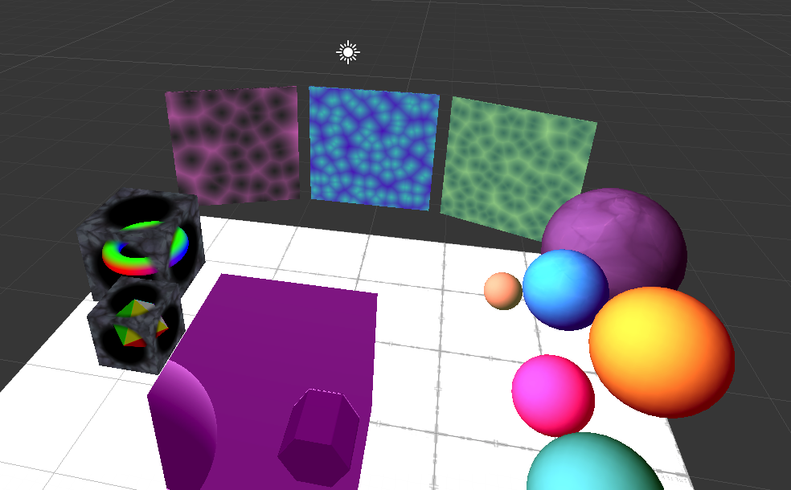

# shadings
Testing shader things in Unity - for Oculus Quest.

## Resources
I'm basing these shaders on:
* Tutorials by [ArtOfCode](https://www.youtube.com/channel/UCcAlTqd9zID6aNX3TzwxJXg)
* Tutorials by [Freya Holmér](https://www.youtube.com/user/Acegikm0)
* [Signed distance function cheatsheet](http://iquilezles.org/www/articles/distfunctions/distfunctions.htm) by Inigo Quilez

## Notes
Raymarching environment is a bit heavy for Quest, move in with care :)

